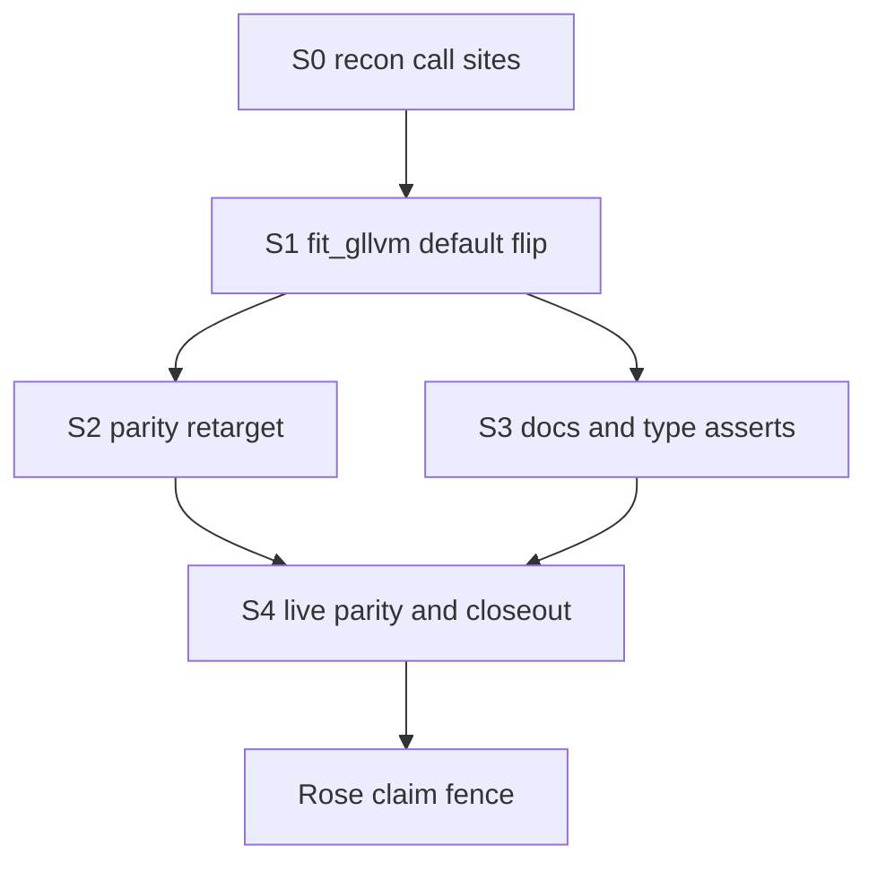

# Default-route NB2/Beta per-trait φ twin parity

**Approved G0:** 2026-08-01. Lane: `default-route-phi-20260801`.
Base tip: `catchup/loglik-oracle-20260801` @ `bbf5d7d8`.
Branch: `parity/default-route-phi-20260801`.
LOOP: `lanes/default-route-phi-20260801/LOOP/` (do not overwrite closed root `LOOP/`).

## GOAL (paste-and-go)

```
PLATFORM = Cursor (solo). After G0, execute via /goal in a FRESH chat — new lane LOOP under
lanes/default-route-phi-20260801/LOOP/ (do NOT overwrite closed catch-up LOOP/GOAL.md).

DELIVERABLE: Public fit_gllvm(NegativeBinomial/Beta) defaults to per-trait φ
(disp_group=:species → NBGroupedFit/BetaGroupedFit), matching gllvmTMB native
log_phi_* length-p and the existing bridge_fit no-X grouped route. Keep
fit_nb_gllvm / fit_beta_gllvm as explicit shared-φ engines. Retarget light
GLLVM_PARITY_TESTS=1 NB2/Beta cells to plain fit_gllvm default path; cascade
tests/docs that assert NBFit/BetaFit from plain fit_gllvm.

HEADLINE: One routing flip in src/families/fit_gllvm.jl for NB/Beta only
(nothing → :species), then honesty cascade + live parity.

PARALLEL: S0 call-site inventory (Composer scout) can overlap docs inventory;
S1–S4 are serial.

DEFER / FENCE: #129/#128; ADEMP; coverage; Totoro/DRAC; “full family parity”;
reopening catch-up observed-Hessian work (already green on grouped);
Dropbox stale fork claude/jl-bridge-capabilities-20260619; Phylo Model A;
ordinal-logit; X-cells; Gamma per-trait (bridge deliberately shared).

DISCIPLINE: Verify with live GLLVM_PARITY_TESTS=1 + core tests that touch
fit_gllvm NB/Beta; Rose claim fence = default-route per-trait φ light logLik
only, not full family parity. Compute = laptop. Close with check-log +
after-task. No push without maintainer ask. Size mode ~2–3 h.
```

## Sweep receipt (Phase 0.25 — gate passed)

- **repo git** → worktree tip `bbf5d7d8` on `catchup/loglik-oracle-20260801` (= handover tip; 20 ahead / 0 behind `origin/main`; main is ancestor); only untracked protected attach scratch → **resume from this tip on a new branch**
- **twin / sister** → `/tmp/gllvmtmb-parity-restart-20260801` @ `cee55a07`; native nbinom2/Beta = length-p per-trait φ; bridge already expects per-trait grouped 1:p → **reuse twin contract; co-opt existing grouped engines + observed Hessian**
- **brain** → per-trait dispersion spec/handovers live; API B locked (Curie) → **reuse idea + locked API B; no parked half-implementation of this exact default flip**
- **Verdict:** **build-the-gap** = public `fit_gllvm` NB/Beta default still routes shared (`disp_group=nothing` → `fit_nb_gllvm`/`fit_beta_gllvm`); bridge no-X already grouped. Gap is unified API + docs/tests/parity entrypoints — not a new likelihood.

## DECISIONS LOCKED

- Lane FRESH; do not reopen catch-up LOOP/GOAL.
- Base: PR-from-catchup @ `bbf5d7d8`.
- API **B (Curie):** `fit_gllvm(NB/Beta)` defaults effective `disp_group=:species`; `fit_nb_gllvm` / `fit_beta_gllvm` remain shared-φ.
- Twin R: `/tmp/gllvmtmb-parity-restart-20260801` @ `cee55a07` (read-only).
- Platform: Cursor → `/goal` after G0.
- Fences as listed in GOAL.
- **Judgment default (mechanical):** For `NegativeBinomial`/`Beta` only, when `disp_group === nothing`, coerce to `:species` before grouped routing. Shared unified opt-in is **not** required this lane — call named shared fitters. Do **not** change Gamma default. Do **not** reopen Hessian implementation if grouped path stays green.
- **Branch name:** `parity/default-route-phi-20260801` from `bbf5d7d8`.
- **LOOP location:** `lanes/default-route-phi-20260801/LOOP/` (leave closed `LOOP/` intact).

## WHAT THE TEAM RAISED

- **Hopper** — Twin default is always length-p φ; Julia public default is the mismatch, not R. Retarget parity to `fit_gllvm` default; keep shared engines tested separately.
- **Curie** — API B already chosen; blast radius is Fit-type asserts + postfit scalar `r`/`φ` accessors on plain `fit_gllvm`. Update ~6 core tests + docs examples; keep `fit_nb_gllvm` recovery tests.
- **Rose** — Do not advertise “full family parity”; claim = default-route per-trait φ light logLik for NB2+Beta only. Fence X_lv shared path and Gamma.
- **Ada** — Gap is routing + honesty cascade; engines exist.

## ARC PROGRAM



## SLICE TABLE

- **S0 RECON** · ~20 min · emit call-site list to `docs/dev-log/plans/scratch/2026-08-01-default-route-phi-callsites.md`
- **S1 ROUTING** · [`src/families/fit_gllvm.jl`](../../src/families/fit_gllvm.jl) (+ docstring) · coerce NB/Beta `nothing`→`:species`
- **S2 PARITY** · `test/parity/test_negbin_parity.jl`, `test_beta_parity.jl`, helpers/README · call plain `fit_gllvm`
- **S3 CASCADE** · core tests asserting `NBFit`/`BetaFit` from plain `fit_gllvm`; docs as needed
- **S4 VERIFY+CLOSE** · live `GLLVM_PARITY_TESTS=1`; check-log; after-task; Rose fence

## VERIFY

- Core: `julia --project=. test/runtests.jl`; full `Pkg.test()` before claiming done.
- Parity: `GLLVM_PARITY_TESTS=1` with twin at `cee55a07`; expect NB2/Beta cells green on **default** `fit_gllvm` path; prior Δ bands (NB2 ~1e-4, Beta ~1e-8) — no silent tolerance widen.
- Shared engines still callable and tested via named fitters.
- Rose: claim string must not say “full family parity.”

## FENCES

#129, #128, ADEMP, coverage, Totoro/DRAC, full-family-parity claim, Dropbox stale fork, attach scratch, catch-up LOOP overwrite, observed-Hessian rework, Gamma default flip, X_lv shared path, push without ask.
