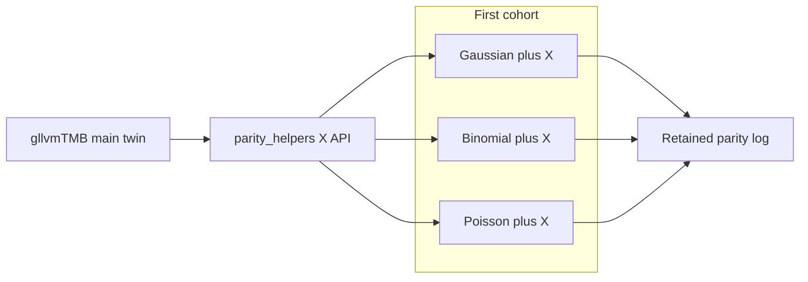

# X/covariate light logLik — Ultra Plan (Phases 0–2)

```
GOAL
Solo platform: Cursor. After G0, execute via /goal in a FRESH chat from a new
worktree branched off origin/main (post-#169 merge tip). Do not write on the
Dropbox stale fork or reopen the closed φ landing LOOP.

Deliverable: First cohort of X/covariate light logLik parity cells —
Gaussian, Binomial (Bernoulli), Poisson — each with q=1 shared site covariate,
green under GLLVM_PARITY_TESTS=1 with retained ΔlogLik evidence (rtol 1e-6).
No silent tolerance widening. No auto-merge. No φ reimplementation.

HEADLINE: Extend the no-X 6-family light oracle surface with 3 shared-X cells
via a new RCall helper + Julia fit_gllvm_cov / fit_gaussian_gllvm(X=) pairing.

IN PARALLEL (cheap): recreate gllvmTMB twin worktree from that package's
origin/main; fetch GLLVM.jl origin/main; board pointer for the new lane.

DEFER / FENCE: NB2/Beta+X (shared φ in fit_gllvm_cov ≠ per-trait default);
Gamma (no no-X oracle yet); Ordinal+X (no cov kernel); X+mask; species-specific
XB; X_lv; ADEMP; #129/#128; Totoro/DRAC; full family / fit parity claims;
grouped_dispersion.jl:61 bug lane; Dropbox coverage-branch gllvmTMB.

DISCIPLINE: Verify by reading parity LOG (ΔlogLik), not exit code alone;
stage by name; no push without instruction; compute = local laptop for 3 cells.
Closure = green cohort log + after-task + Rose fence (light logLik with shared X).
```

**ARC PROGRAM:** size · ~3–4 h · Arc 0 inventory already done in planning (recon) · Rung 1 = implement 3 cells · Rung 2 = repair · closeout after-task. Under-run → park; do not invent NB2+X.

---

## Phase 0.25 sweep RECEIPT

| Surface | Evidence | Finding | Call |
|---|---|---|---|
| **repo git** | [recon](5e0c6ebe-dcaa-4b4e-b125-00ad3539e2e5): remote `main` = `4d19c503` (#169 merged); φ worktree `f476a40f` = merge parent; Dropbox root stale `6694f43d` | Landing DONE; X cells absent | **new branch from fetched `origin/main`** |
| **twin gllvmTMB** | `/tmp/gllvmtmb-parity-restart-20260801` **MISSING**; Dropbox gllvmTMB on coverage branch `f235d5d6` (wrong lane) | Oracle partner must be recreated from gllvmTMB `origin/main` | **recreate twin; do not use coverage branch** |
| **brain** | `search_notes` `"X covariate light logLik parity GLLVM fit_gllvm_cov"` `search_all_projects:true` | No parked decision against shared-X light cells; no prior completed X-cohort plan | **build-the-gap** |
| **Verdict** | — | Gap = **0 X light cells**; engines already accept X for G/Bin/Pois | **build helper + 3 cells** |

External NotebookLM: **off** (harness extension, not novelty).

## Phase 0.3 / 0.3b

- Scout/mechanical: Cursor Models (Composer). Judgment / claim fence: Other Models (Auto Cost / Claude).
- Settings → Usage meters: **UNVERIFIED this session** — glance before `/goal` dispatch.
- Compute: **local** (3 tiny cells). Totoro/DRAC not required.

## Decisions locked

- **First cohort = 3 cells:** Gaussian, Binomial, Poisson; **q=1 shared site X** (`X[t,s,1] = x_s`); tiny fixture (`p≈5`, `K=2`, `n≈20–30`); rtol `1e-6`.
- Julia: [`fit_gaussian_gllvm`](src/fit.jl) with `X=`; [`fit_gllvm_cov`](src/families/covariates.jl) for Binomial/Poisson.
- R: extend [`test/parity/parity_helpers.jl`](test/parity/parity_helpers.jl) — today hard-codes no-X formula `value ~ 0 + trait + latent(...)`; add shared-site-X helper (new function preferred over silently changing the no-X helper).
- Success bar: **≥2/3 green** with honest block receipt for any red; **do not widen rtol**.
- Write base: **new worktree** from `origin/main` @ `4d19c503` (or newer); never Dropbox stale fork.
- Fence NB2/Beta+X this arc (dispersion identity mismatch).



## TEAM RAISED

- **Hopper** — R formula must match shared γ (site `x`, not `x:trait`) · identity mismatch is the main fail mode · recommend new helper `fit_gllvmtmb_parity_loglik_x` · default if silent: shared site slope.
- **Rose** — claim must stay “light logLik with shared X for G/Bin/Pois” · never “full family parity” · fence NB2/Beta+X · default: after-task fence paragraph.
- **Curie** — success = LOG ΔlogLik, not exit code · ≥2/3 green OK with one blocked · default: no tol widen.
- **Ada** — recommend G0 approve this cohort; twin recreate is part of Arc 0 execution.

## Phase 0.4 — G0 questions (≤2)

**Q1 (blocking):** Approve this Ultra Plan (3 shared-X light cells; new branch/worktree from `origin/main`; recreate gllvmTMB twin from **its** `origin/main`)?  
**Recommendation:** Yes.  
**If you do not mind:** Treat plan approval as yes.

**Q2:** After G0, OK to leave NB2/Beta+X strictly fenced (separate later arc)?  
**Recommendation / default:** Yes — fence holds.

## SLICE TABLE (post-G0 `/goal`)

| ID | Slice | Member | Model | Bar | ~time | Deps | Output |
|---|---|---|---|---|---:|---|---|
| S0 | RECON refresh + fetch main + twin recreate | landscape-scout | Composer low | Cursor Models | 20–30m | — | Worktree @ `origin/main`; twin `/tmp/…` from gllvmTMB main SHA recorded |
| S1 | Design shared-X RCall helper + DGP | Hopper | Auto Cost med | Other Models | 30–45m | S0 | `parity_helpers.jl` X API; symbolic note of formula |
| S2 | Wire 3 test files + runparity include | Curie | Composer / Auto | Cursor or Other | 45–60m | S1 | 3 cells calling Julia X fitters |
| S3 | Live parity run + LOG inspect | Curie | Composer | Cursor Models | 20–40m | S2 | `/tmp` or retained log; ΔlogLik per cell |
| S4 | Repair identity mismatches | Hopper + Gauss | Auto Cost | Other Models | 30–60m | S3 if red | Green or honest block |
| S5 | MECHANICAL-VERIFY | reproducibility-engineer | Composer low | Cursor Models | 15m | S3/S4 | Cell count; no tol widen; twin SHA |
| S6 | Rose claim fence + after-task | systems-auditor | Auto Cost | Other Models | 20m | S5 | after-task + check-log + board row |
| S7 | RECONCILE | Melissa | Auto Cost low | Other Models | 15m | Close | `docs/dev-log/plan-actual/2026-08-02-gllvm-x-covariate-light-loglik.md` |

**PARALLEL:** none material after S0 (S1→S2 serial).  
**FAN-OUT BUDGET:** checkpoint=`x-covariate-light-loglik-20260802` · ≤4 children · scout yes · no Sol ceiling unless Rose blocks claim.  
**LUNA SUITABILITY:** yes — S0/S5 on Composer.  
**ULTRA EFFORT:** no.  
**LANE RECEIPT after G0:** `START A FRESH TASK` via `/goal` below.

## Paste-ready `/goal` (after G0)

```text
/goal First X/covariate light logLik cohort for GLLVM.jl.

Ultra-plan G0 approved. Plan artifact: docs/dev-log/plans/2026-08-02-gllvm-x-covariate-light-loglik-ultra-plan.md
(write in new worktree if missing).

LANE: x-covariate-light-loglik-20260802
REPO worktree: NEW from origin/main (post-#169, tip ≥ 4d19c503). Not Dropbox stale fork.

SCAFFOLD LOOP/ then RUN:
1. Fetch origin/main; create worktree+branch parity/x-covariate-light-loglik-20260802.
2. Recreate gllvmTMB twin from that repo's origin/main into /tmp (record SHA); do NOT use Dropbox coverage branch.
3. Add shared-X RCall helper (keep no-X helper intact) + 3 cells: Gaussian, Binomial, Poisson; q=1 site X.
4. Julia: fit_gaussian_gllvm(; X=) / fit_gllvm_cov for Bin/Pois.
5. Run GLLVM_PARITY_TESTS=1; verify by LOG ΔlogLik (rtol 1e-6); no tol widen.
6. Fence NB2/Beta+X, Gamma, Ordinal+X. Close with after-task + Rose fence + plan-actual.

START ARC: S0. NEXT GATE: push/PR only if maintainer asks.
```

## G0 ask

Approve this plan to unlock a fresh `/goal` chat. Reply e.g. `G0 OK` / `approve`. No Phase 3 until then.
