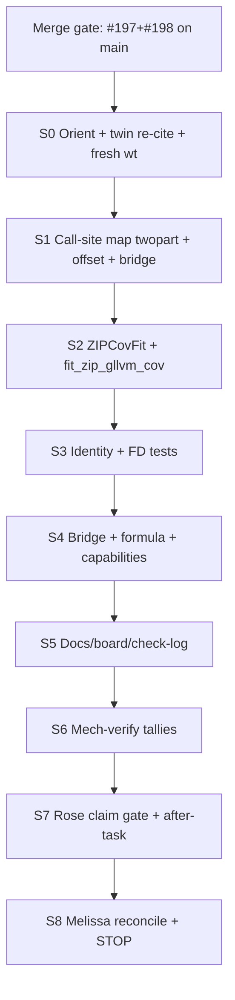

# ZIP+X engine Arc 0 — Ultra Plan (Phases 0–2) — G0 APPROVED

**Status:** **G0 APPROVED** 2026-08-09 (Shinichi). Q1–Q3 locked below.  
**Plan source:** `~/.cursor/plans/zip+x_engine_ultra-plan_583ae235.plan.md`  
**Arc Card:** `docs/dev-log/plans/2026-08-09-zip-x-engine-arc0-arc-card.md`  
**LOOP kit:** `lanes/zip-x-engine-20260809/LOOP/`  
**Scaffold tip:** branch `docs/zip-x-engine-ultraplan-20260809` on worktree
`.worktrees/gllvmjl-post-bb-x-capacity-handover-20260809` (local commit OK;
no push unless asked).

```
GOAL
Solo platform: Cursor (/goal SCAFFOLD + STOP at merge gate)
Deliverable: persisted ultra-plan + Arc Card + LOOP kit; paste-ready /goal
RESUME for ZIP+X engine Arc 0 after #197+#198 MERGED (no engine src/ yet)
HEADLINE: gate a colleague-runnable /goal that ships fit_zip_gllvm_cov /
ZIPCovFit under ACCEPTED Identity (separate γ^z/γ^c, Λ_z=0) with Julia
identity+FD≤1e-6 and bridge/@formula ZIP+X admit — twin-asymmetric, no light Δ
IN PARALLEL (cheap, plan-time only): persist Arc Card to disk; twin ZIP-cut
re-cite; call-site map notes for twopart.jl + _build_offset + bridge/formula
DEFER/FENCE: Phase 3 / src/ ZIP engine until #197+#198 MERGED; twin light
RCall Δ; ZINB/hurdle/Tweedie+X; ADEMP/coverage; Phylo #127; Dropbox checkout
writes; merge PRs (other lane); git add -A; push without ask; full family
parity; silent rtol widen
DISCIPLINE: verify=identity+FD tallies + Rose fence (no twin Δ) · compute=laptop
(no Totoro/DRAC) · closure=plan on disk + G0 approval + STOP (await merges
before engine /goal)
```

**ARC PROGRAM:** size · recommended **~3.5–4.5 h** (ladder **~5–5.5 h**) ·
Arc 0 outcome = `fit_zip_gllvm_cov` / `ZIPCovFit` + Julia identity/FD +
bridge/`@formula` (one-part + X) ZIP admit · pointer: Arc Card (prior
`/arc-creation` transcript
[325d393f…](325d393f-fcac-4dda-ba4c-3ffbf66d39b7) subagent `33d75e43…`).

**Execution gate (hard):** start engine `/goal` **only after** `#197` and
`#198` are both **MERGED** to `main`. This ultra-plan does **not** merge and
does **not** edit `src/` for ZIP until that gate clears.

---

## G0 approval + locked answers (Q1–Q3)

| Q | Decision (locked 2026-08-09) |
| --- | --- |
| **Q1** — Optional Rung 2 (ZIP+X confint) in same `/goal`? | **NOT in DoD**; optional under-run only if Arc 0+docs finish early |
| **Q2** — Also admit no-X `zip` on `_BRIDGE_ONEPART`? | **Yes** — admit both one-part (`fit_zip_gllvm`) and X (`ZIPCovFit`) |
| **Q3** — Persist Arc Card beside ultra-plan? | **Yes** — both files under `docs/dev-log/plans/` |

### Ada-locked defaults (approved)

1. Names: `fit_zip_gllvm_cov` / `ZIPCovFit`; packing as Identity.  
2. No twin light RCall cell in this arc.  
3. Rung 2 confint = optional under-run only (not DoD).  
4. Admit bridge one-part + X `zip` in same arc.  
5. Fresh worktree off `origin/main` after merges; Dropbox PROTECTED.  
6. Persist Arc Card + ultra-plan + LOOP kit (local commit on docs branch OK;
   no push unless asked).

---

## Phase 0.25 — Sweep receipt (gate passed at plan time)

| Surface | Evidence ran | Finding | Call |
| --- | --- | --- | --- |
| **repo git** | worktree `docs/zip-x-identity-20260809` @ `90e8abae`; `gh pr view 197/198` | #197 OPEN (Julia CI); #198 OPEN on #197 tip; Identity ACCEPTED on disk; **no** ZIP engine branch/src | **wait** merges; **build-the-gap** = engine after STOP |
| **twin gllvmTMB** | local twin: ZIP/ZINB cut; no `family_to_id` ZIP arm | twin ZIP absent — light Δ forbidden | **co-opt** cut as fence; **re-cite** at execute S0 |
| **brain** | MCP search ZIP+X engine / Identity | two-part design + capacity Identity; no contradictory lock | **reuse** Identity + two-part §2.2 |
| **capability / check-log** | zip implemented (no-X); Identity STOP before engine | public bridge still omits `zip` | **implement** cov + bridge admit |
| **src gap** | `fit_zip_gllvm` / `ZIPFit`; `zip_marginal` kwargs incl. `offsetz`/`offsetc`; no-X wires `offsetc` only; `_build_offset` exists; `zip` ∉ `_BRIDGE_*` | dual-γ packing is the novel gap | **build** `ZIPCovFit` + dual offsets |
| **Verdict** | — | Genuinely new = Julia ZIP+X fitter + identity/FD + bridge/@formula under locked Identity | **build-the-gap** (after merge STOP) |

---

## Phase 0.3 / 0.3b — Cursor two-bar routing

| Slice shape | Bar | Route |
| --- | --- | --- |
| Scout / recon / grep / call-site map | **Cursor Models** | Composer 2.5 or Grok 4.5 |
| Engine build / identity tests / bridge | **Cursor Models** | Composer/Grok Agent in `/goal` |
| Judgment / Rose claim fence / prose | **Other Models** | Auto Cost or pinned Claude/GPT |
| Orchestration / adversarial close / HPC | **hand off** | Claude Opus (not Cursor parent) |

MODEL-ROUTING volatile row: Cursor two-bar hygiene refreshed 2026-08-01.

---

## WHAT THE BRAIN / REPO ALREADY KNOW

- Identity ACCEPTED:
  `docs/dev-log/decisions/2026-08-09-zip-x-identity.md` — shared site-X,
  separate `γ^z`/`γ^c`, `Λ_z=0`, twin-asymmetric.
- Two-part design §2.2 ZIP mixture + v1 `Λ_z=0`
  (`docs/superpowers/specs/2026-05-31-two-part-families-design.md`).
- Capacity programme STOP before ZIP engine; merges still OWED (#197/#198).
- Analogues: Gamma/Ordinal Julia-forward engines (~3.5 h) for shape; BB/NB1+X
  for bridge patterns — **not** for light RCall.
- Substrate: `offsetz`/`offsetc` on twopart marginal; `_build_offset(X,γ)`;
  no-X ZIP packs `[βz; βc; pack(Λc)]`.

---

## TEAM RAISED (defaults now locked via Q1–Q3)

```
TEAM RAISED
  Gauss  — Dual-γ packing novel; wire Oz=_build_offset(X,γz),
           Oc=_build_offset(X,γc); substrate fix ≤30m if offsetz path broken
  Fisher — zero-X ≈ fit_zip_gllvm; packed FD ≤1e-6; no rtol widen;
           Rung 2 confint optional under-run only (Q1)
  Hopper — admit zip one-part + X→ZIPCovFit (Q2); no twin Δ
  Rose   — claim fence: Julia ZIP+X ≠ twin parity ≠ ADEMP; persist Arc Card (Q3)
  Ada    — G0 approved; scaffold LOOP; STOP until merges; then /goal fresh wt
```

---

## Phase 0.5 — NotebookLM

Declined — twin-asymmetric Julia-forward; Identity + two-part design authoritative.

---

## Phase 1 — Decomposition



| ID | In → Out | Dep |
| --- | --- | --- |
| S0 | Confirm merges; twin ZIP still cut; cut fresh `.worktrees/…` @ `origin/main` | gate |
| S1 | Scratch map: `fit_zip_gllvm`, `zip_marginal` kwargs, `_build_offset`, bridge/formula Unions | S0 |
| S2 | `ZIPCovFit` + `fit_zip_gllvm_cov` packing `[βz; γ^z; βc; γ^c; pack(Λc)]`; export | S1 |
| S3 | `test/test_zip_x_identity.jl`: zero-X ≈ no-X; packed FD ≤ 1e-6 | S2 |
| S4 | Admit `zip` bridge/@formula (X→cov; one-part→`fit_zip_gllvm`); capabilities golden | S3 |
| S5 | capability-status / board / AGENTS / check-log / after-task draft | S4 |
| S6 | MECHANICAL-VERIFY tallies + fence grep (no twin Δ / no rtol widen) | S5 |
| S7 | Rose claim gate | S6 |
| S8 | Melissa plan-actual + Actuals + STOP | S7 |

Hard stop: if dual-γ FD > 1e-6 by ~90 min of core, **do not** bridge-admit —
return packing diagnosis.

---

## Phase 2 — SLICE TABLE

| Slice | Member | Model | Bar | Time | Detail | Dep |
| --- | --- | --- | ---: | --- | --- | --- |
| RECON S0 | Ada / Shannon | Composer | Cursor Models | 25–35m | merges; twin cut; fresh wt `feat/zip-x-engine-YYYYMMDD` | gate |
| RECON S1 | Gauss | Composer/Grok | Cursor Models | 20–30m | call-site map → `docs/dev-log/plans/scratch/` | S0 |
| BUILD S2 | Gauss / julia-engineer | Composer | Cursor Models | 110–150m | `twopart.jl` + `GLLVM.jl` exports | S1 |
| BUILD S3 | Curie / Fisher | Composer | Cursor Models | 45–60m | `test_zip_x_identity.jl` + runtests wire | S2 |
| BUILD S4 | Hopper / Emmy | Composer | Cursor Models | 40–50m | `bridge.jl` / `formula.jl` / capabilities | S3 |
| BUILD S5 | Ada | Composer | Cursor Models | 20–30m | docs cascade + board START HERE | S4 |
| MECH-VERIFY S6 | Grace / systems-auditor | Composer | Cursor Models | 20–30m | tallies; fence strings | S5 |
| VERIFY S7 | Rose | Claude Opus | **hand off** | 15–20m | claim-vs-evidence | S6 |
| RECONCILE S8 | Melissa | Auto Cost | Other Models | 10–15m | `docs/dev-log/plan-actual/2026-08-09-zip-x-engine.md` | S7 |

**FAN-OUT:** S0∥S1 early; then serial build.  
**LUNA SUITABILITY:** yes — RECON + MECHANICAL-VERIFY on Composer/Grok.  
**ULTRA EFFORT:** no.  
**ESTIMATE:** ~3.5–4.5 h Arc 0 · ladder to ~5.5 h · one fresh `/goal` chat
after merges.  
**VERIFY:** identity+FD + bridge smoke + Rose fence.  
**RECONCILE:** Melissa required (meaningful engine close).

### Rose plan critique (decomposition)

- Twin asymmetry correctly removes light-cell slices — good.
- Risk: treating `offsetz` as free when no-X only wires `offsetc` — S1 must
  prove kwargs path before S2 packing.
- Do not let optional Rung 2 inflate claims or burn repair reserve.
- Do not start `/goal` on Identity branch tip — fresh from post-merge `main`.

---

## Scaffold landed (this `/goal` turn — no Phase 3)

1. This file (full approved plan).  
2. Arc Card:
   `docs/dev-log/plans/2026-08-09-zip-x-engine-arc0-arc-card.md`.  
3. LOOP kit:
   `lanes/zip-x-engine-20260809/LOOP/{GOAL,arcs,checkpoint,ultra-plan}.md`.

**OPEN GATE:** wait `#197` + `#198` MERGED. Do **not** start S2 engine build.

---

## Paste-ready `/goal` RESUME (after merges)

See `lanes/zip-x-engine-20260809/LOOP/checkpoint.md` RESUME line — also
emitted in the SCAFFOLD closeout message.
