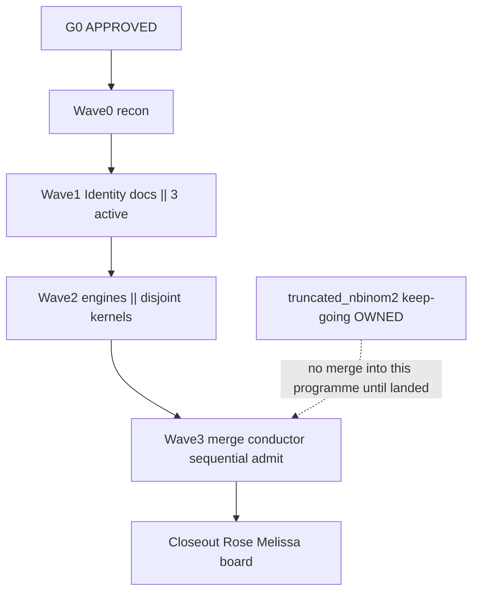

# Parallel family catch-up (3–5) — G0 LOCKED 2026-08-15

**Status:** G0 APPROVED by Shinichi (Ada 4-set + compute + Identity posture).  
**Source plan:** Cursor `parallel_family_catchup_d75a011b` + G0 locks below.  
**Programme WT:** `.worktrees/gllvmjl-parallel-family-catchup-20260815` on `cursor/parallel-family-catchup-20260815`  
**Why not catch-up WT path:** `.worktrees/gllvmjl-capability-catchup-20260815` is the live #205 lane (busy) — plan lives here per G0 “if busy → new WT”.  
**Base tip:** catch-up tip `b2b99463` / `origin/cursor/capability-catchup-20260815` because **#205 not merged** at launch (re-check before Wave2 rebase).  
**LOOP:** `lanes/gllvmjl-parallel-family-catchup-20260815/LOOP/`  
**FORBIDDEN:** Dropbox protected fork `claude/jl-bridge-capabilities-20260619`; double-own / interrupt `cursor/truncated-nbinom2-20260815` / its WT.

---

## 🎯 GOAL

```
Solo platform: Cursor. Execute via /goal — Identity|| → engines|| → admit-serialize.

Deliverable: Land Identity + engine + focused FD/tests for 3 active families
(lognormal, ZIB+X, censored_poisson) under the ownership matrix; truncated_nbinom2
counted in set but OWNED elsewhere (do not touch).

HEADLINE: Run 3 active families in parallel while treating truncated_nbinom2 as
already claimed.

IN PARALLEL: Identity docs-only waves (disjoint decision paths); family kernels
on disjoint src/families/*.jl + test/test_*.jl.

DEFER / FENCE: Dropbox stale fork; invent ZIP/ZINB twin Δ; Phylo Model A;
ADEMP/coverage unless Totoro/DRAC asked; silent rtol; hurdle/student/com_poisson
(already implemented on catch-up tip); categorical/multinomial primary;
double-own truncated_nbinom2; touch shared choke points outside merge-conductor;
git add -A.

DISCIPLINE: verify = FD ≤1e-6 + focused suite + Rose claim fence · compute =
local tiny + light RCall only when twin admits · closure = after-task +
check-log + board + Melissa · push/PR when a wave is green (autonomy) · merge
on full CI green.
```

### G0 locks (binding)

| Lock | Value |
|---|---|
| **Set** | Ada 4: truncated_nbinom2 (**OWNED/in-flight**) + **lognormal** + **ZIB+X** + **censored_poisson** |
| **Active this programme** | lognormal, ZIB+X, censored_poisson only |
| **Compute** | local tiny + FD; light RCall only when twin admits; ≠ ADEMP |
| **Identity posture** | Julia-forward OK where twin cut/absent; never invent ZIP/ZINB Δ |

---

## Candidate ranking (post-#205 ledger truth @ catch-up tip)

| Candidate | Ledger | Twin | Verdict |
|---|---|---|---|
| truncated_nbinom2 | planned (owner flipping) | fid 11 | **OWNED** — WT `gllvmjl-truncated-nbinom2-20260815` / `cursor/truncated-nbinom2-20260815` — **do not double-own** |
| hurdle_* / com_poisson / student | implemented | — | **DROP** |
| ZIB+X | zib base implemented; no `fit_zib_gllvm_cov` | ZIP/ZINB cut | **INCLUDE** — Julia-forward only |
| lognormal (one-part) | planned | fid 3 | **INCLUDE** — twin Δ light when admits |
| censored_poisson | missing | R ctor; cpp fid absent | **INCLUDE** — Identity first; Julia-forward engine if twin engine absent |
| categorical / multinomial | missing | fid 16 | **DEFER** |

---

## Parallelism design



| Wave | Mode | What | Serialize? |
|---|---|---|---|
| 0 | || scout | Twin/fid/call-site map per family | no |
| 1 | \|\| | Identity decisions (3 active) | no — disjoint `docs/dev-log/decisions/*` |
| 2 | \|\| | Family kernels + focused tests | **only if** file ownership disjoint |
| 3 | sequential | Admit shared choke points | **yes — merge conductor** |
| 4 | sequential | Full `Pkg.test` once after admits | yes |

**Shared choke points (conductor-only):** `src/GLLVM.jl`, `src/families/fit_gllvm.jl`, `src/bridge.jl`, `docs/design/capability-status.md`, `test/runtests.jl` (+ formula/dispatch if needed).

**ZIB+X may also touch (still conductor-reviewed):** `src/families/twopart.jl`, `src/formula.jl`, `src/confint_family.jl` — **not** parallel with another twopart editor.

---

## File-ownership matrix

| Path | lognormal | ZIB+X | censored_poisson | truncated_nbinom2 | Admit conductor |
|---|---|---|---|---|---|
| `src/families/lognormal.jl` (new) | OWN | — | — | — | merge |
| `test/test_lognormal.jl` (new) | OWN | — | — | — | merge |
| `docs/dev-log/decisions/*-lognormal-identity.md` | OWN | — | — | — | merge |
| `src/families/twopart.jl` (ZIB cov) | — | OWN | — | — | merge |
| `test/test_zib_x*.jl` (new) | — | OWN | — | — | merge |
| `docs/dev-log/decisions/*-zib-x-identity.md` | — | OWN | — | — | merge |
| `src/families/censored_poisson.jl` (new) | — | — | OWN | — | merge |
| `test/test_censored_poisson.jl` (new) | — | — | OWN | — | merge |
| `docs/dev-log/decisions/*-censored-poisson-identity.md` | — | — | OWN | — | merge |
| `src/families/truncated_nbinom2.jl` | — | — | — | **OWNED elsewhere** | wait |
| Shared exports / fit_gllvm / bridge / capability-status / runtests | — | — | — | — | **ONLY** |
| Dropbox fork | FORBIDDEN | FORBIDDEN | FORBIDDEN | FORBIDDEN | FORBIDDEN |

Fan-out ≤6 children/checkpoint: Wave1 = 3 Identity; Wave2 = 3 engines; Admit = 1; Rose fences bind.

---

## Arc Cards + budgets

| Family | Identity Arc 0 | Engine | Notes |
|---|---:|---:|---|
| truncated_nbinom2 | (owned) | (owned) | Do not schedule here |
| lognormal | 90–120 min | 5–7 h | Twin fid 3; light RCall if admits |
| ZIB+X | 90–120 min | 5–7 h | Clone ZIP+X; Julia-forward; no twin Δ |
| censored_poisson | 90–150 min | 5–8 h | Twin R ctor; cpp fid absent → Identity fence claim |

| Mode | Estimate |
|---|---|
| **Parallel** (3 active) | **~11–13 h wall** |
| **Serial** | **~28–36 h** |

---

## Worktree / branch map (Wave1)

| Role | Worktree | Branch | Base |
|---|---|---|---|
| Programme conductor | `.worktrees/gllvmjl-parallel-family-catchup-20260815` | `cursor/parallel-family-catchup-20260815` | catch-up tip `b2b99463` |
| lognormal Identity | `.worktrees/gllvmjl-lognormal-identity-20260815` | `cursor/lognormal-identity-20260815` | same |
| ZIB+X Identity | `.worktrees/gllvmjl-zib-x-identity-20260815` | `cursor/zib-x-identity-20260815` | same |
| censored_poisson Identity | `.worktrees/gllvmjl-censored-poisson-identity-20260815` | `cursor/censored-poisson-identity-20260815` | same |
| truncated_nbinom2 | `.worktrees/gllvmjl-truncated-nbinom2-20260815` | `cursor/truncated-nbinom2-20260815` | **DO NOT TOUCH** |
| #205 catch-up | `.worktrees/gllvmjl-capability-catchup-20260815` | `cursor/capability-catchup-20260815` | check merge only |

After #205 merges: rebase active branches onto `origin/main` before Wave2 engines.

---

## Autonomy / git / CI

- Stage **by name** only (`git add path` — never `git add -A`).
- **Push/PR when a wave is green** (Shinichi autonomy for this programme).
- **Merge on full CI green** only.
- Do not interrupt keep-going agent on nbinom2/#205 beyond merge-state checks.
- Never write the Dropbox protected fork.

---

## Rose fences (bind every wave)

- ≠ invent ZIP/ZINB twin Δ  
- ≠ Phylo Model A / #127  
- ≠ ADEMP unless Totoro/DRAC asked  
- ≠ silent rtol widen  
- ≠ overclaim twin parity where twin cut/absent  
- Julia-forward OK with explicit Identity fence text

---

## TEAM RAISED (frozen at G0)

```
Rose  — drop already-implemented candidates; Ada 4-set
Gauss — engines|| only with disjoint files; twopart.jl single-owner (ZIB+X)
Fisher — light RCall only when twin admits; no invent Δ
Curie — ≠ ADEMP; local tiny + FD
Ada   — lock 4-set; Identity|| then engines||; conductor admit; do not interrupt nbinom2
```

---

## Definition of done (programme)

1. Three Identity decisions ACCEPTED (one PR each or batched docs PRs) with Rose fence language.
2. Three engines landed on owned files with FD ≤1e-6 + focused tests green.
3. Merge-conductor admits shared choke points once; ledger flip honest.
4. Full `Pkg.test` green on admit branch; CI green before merge.
5. truncated_nbinom2 never edited by this programme.
6. After-task + check-log + board + Melissa at close.
