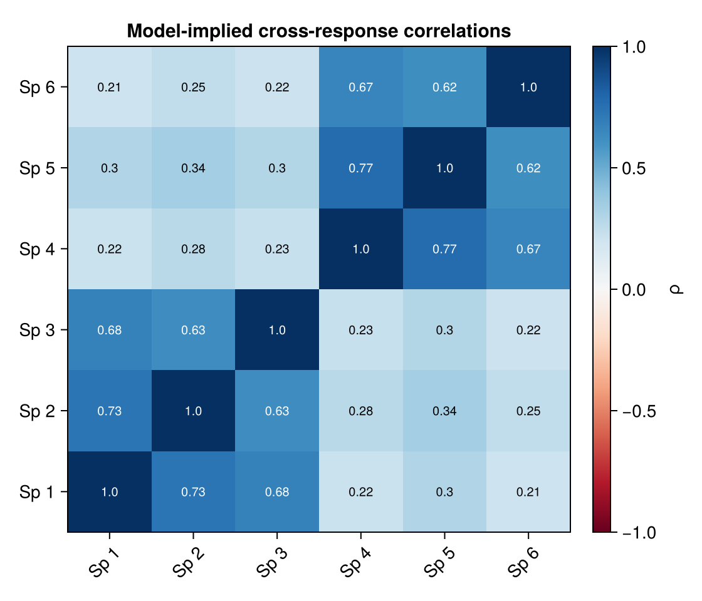

# GLLVM.jl

Fast Generalised Linear Latent Variable Models in Julia for multivariate
response matrices.

## Install

```julia
using Pkg
Pkg.add(url = "https://github.com/itchyshin/GLLVM.jl")
```

GLLVM.jl is not yet in the General registry, so `Pkg.add("GLLVM")` will not
resolve. Use Julia 1.10 or later.

## Fit your first model

Most analyses start with the same scientific question:

> Which responses vary together, and how much variation is shared rather than
> response-specific?

For continuous multivariate data, the Gaussian path is the smallest complete
example:

```julia
using GLLVM, Random

Random.seed!(1)
n, p, K = 80, 5, 2                         # sites, responses, latent axes
Λ = 0.7 .* randn(p, K)
Y = Λ * randn(K, n) .+ 0.5 .* randn(p, n)  # p × n response matrix

fit = fit_gaussian_gllvm(Y; K = K)
communality(fit)   # shared-variance fraction per response
correlation(fit)   # model-implied cross-response correlation matrix
```



The heatmap is a simulated two-factor Gaussian fit. The off-diagonal structure
is what `correlation(fit)` reports: responses that share a latent axis correlate,
and responses with no shared axis stay near zero.

## What The Fit Gives You

After fitting, the usual report-ready quantities are:

- `sigma_y_site(fit)` for the among-response covariance `Σ_y`;
- `communality(fit)` for the shared-variance fraction per response;
- `correlation(fit)` for model-implied cross-response correlations;
- `phylo_signal(fit)` for the phylogenetic share of trait variation;
- `getLV(fit)` and `getLoadings(fit)` for ordination scores and loadings.

## Start Here

- First Gaussian fit: [Quick start](/quickstart).
- Model equation and estimands: [Model](/model).
- Ordination, predictions, residuals, AIC, and BIC:
  [Working with a fit](/working-with-a-fit).
- Response-family choice: [Response families](/response-families).
- R twin comparison: [Capability parity](/gllvmtmb-parity).

## Current Status

!!! tip "What works today"
    - One-part fits through `fit_gllvm`: Gaussian, Binomial, Poisson,
      NegativeBinomial, Beta, Ordinal (logit or probit), Gamma, Exponential, and
      Tweedie — plus dedicated drivers for NB1 (`fit_nb1_gllvm`), beta-binomial
      (`fit_beta_binomial_gllvm`), and a heteroscedastic / per-species-variance
      Gaussian (`fit_gaussian_pervar_gllvm`).
    - Per-species / grouped dispersion (gllvm's `disp.group`) for NB2, NB1, Beta,
      Gamma, and Tweedie via the `_grouped` drivers.
    - Two-part / mixture fitters: Delta-lognormal, Delta-Gamma, Hurdle-Poisson,
      Hurdle-NB, beta-hurdle, ordered-beta, ZIP, ZINB, and ZIB.
    - A variational (VA / ELBO) estimator alongside Laplace, with VA-based SEs;
      the ordination trio (unconstrained / concurrent / constrained-RRR);
      species-specific covariates, fourth-corner, fixed and random row effects,
      and quadratic response.
    - Structured latent fields: SPDE / Matérn spatial (with kriging) and
      phylogenetic, including a phylogenetic GLM fit (`fit_phylo_glm`) for
      non-Gaussian families.
    - The `@formula` front-end, and non-Gaussian confidence intervals (Wald /
      profile / bootstrap) via `confint(fit, Y; method=…)` for scalar-dispersion
      and grouped-dispersion NB2/NB1/Beta/Gamma routes; per-trait ordinal
      cutpoint CIs remain a bridge-status follow-up.

## Relation To gllvmTMB

R `gllvmTMB` remains the reference model surface and the richer applied article
set. GLLVM.jl is the Julia companion: matrix-first today, formula syntax later,
with the same core estimands and a stronger performance path for large Gaussian
and phylogenetic fits. See [Comparison vs gllvmTMB](/comparison) and
[Benchmarks](/benchmarks) for the validated Gaussian + phylogenetic benchmark
grid.

## Citing

GLLVM.jl does not yet have its own software citation. For now, cite the methods
it builds on: Hadfield & Nakagawa (2010, *J. Evol. Biol.*) for the sparse
phylogenetic precision; Tipping & Bishop (1999, *JRSS-B*) for the
probabilistic-PCA initialiser; and Bates et al. (2015, *J. Stat. Soft.*) for
the profile-out and sparse mixed-model machinery. The edge-incidence
phylogenetic representation follows Bolker's `phylog.rmd`.

## Getting Help

- Questions and bugs: open an issue on [GitHub](https://github.com/itchyshin/GLLVM.jl/issues).
- Function help: in the Julia REPL, type `?` then a name, for example `?fit_gaussian_gllvm`.
- Planned work: see the [Roadmap](/roadmap).
