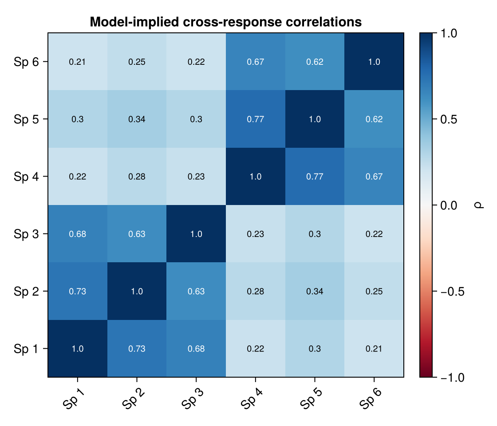

```@raw html
---
layout: home

hero:
  name: "GLLVM.jl"
  text: "Which responses vary together?"
  tagline: "A matrix-first Julia companion for separating shared multivariate structure from response-specific variation."
  actions:
    - theme: brand
      text: Fit the first Gaussian model
      link: /quickstart
    - theme: alt
      text: Interpret covariance and correlation
      link: /covariance-correlation
    - theme: alt
      text: Check capability parity
      link: /gllvmtmb-parity

features:
  - title: "Start with a response matrix"
    details: "Responses are rows and sites are columns: p × n. The first route makes that orientation explicit before fitting."
  - title: "Read the covariance first"
    details: "Use model-implied Sigma, correlation, and the shared-variance fraction before attaching meaning to a rotated loading axis."
  - title: "A companion, not a replacement"
    details: "GLLVM.jl is matrix-first and partial parity. Use gllvmTMB for the richer formula-first R workflow and its route-specific evidence boundary."
---
```

# Start with the response matrix

Fast Generalised Linear Latent Variable Models in Julia for multivariate
response matrices.

!!! warning "Matrix Orientation: $p \times n$ in Julia vs $n \times p$ in R"
    **GLLVM.jl expects species/traits in rows and sites/observations in columns ($p \times n$).**

    If you are importing data formatted for R packages such as `gllvm` or `gllvmTMB` (which use the $n \times p$ convention with sites in rows and species in columns), you must transpose your matrix (`Y'`) before passing it to `fit_gllvm`, `fit_gaussian_gllvm`, or any other GLLVM.jl fitter.

## Install

```julia
using Pkg
Pkg.add(url = "https://github.com/itchyshin/GLLVM.jl")
```

GLLVM.jl is not yet in the General registry, so `Pkg.add("GLLVM")` will not
resolve. Use Julia 1.10 or later.

## Fit your first model

Most analyses start with the same scientific question:

> Which responses vary together, and how much variation is shared rather than
> response-specific?

For continuous multivariate data, start with the Gaussian route that gives
each response its own residual variance:

```julia
using GLLVM, Random, LinearAlgebra

Random.seed!(1)
n, p, K = 80, 5, 2                         # sites, responses, latent axes
Λ = 0.7 .* randn(p, K)
ψ = 0.15 .+ 0.10 .* rand(p)                # one residual variance per response
Y = Λ * randn(K, n) .+ sqrt.(ψ) .* randn(p, n)  # p × n response matrix

fit = fit_gaussian_pervar_gllvm(Y; K = K)

# Rotation-invariant summaries implied by the per-response fit
Σ = fit.Λ * fit.Λ' + Diagonal(fit.ψ²)
c² = diag(fit.Λ * fit.Λ') ./ diag(Σ)       # shared-variance fraction
R = Diagonal(1 ./ sqrt.(diag(Σ))) * Σ * Diagonal(1 ./ sqrt.(diag(Σ)))
```



The heatmap is a simulated two-factor Gaussian fit. Its off-diagonal structure
is what the explicit `R` calculation reports: responses that share a latent axis correlate,
and responses with no shared axis stay near zero.

This is the matrix-first companion to the ordinary R
[`gllvmTMB`](https://itchyshin.github.io/gllvmTMB/) teaching route. Both use
`Sigma = Lambda * Lambda' + Psi`; here `Psi` has one diagonal residual
variance per response. R's wide formula is `traits(...) + latent(...)`, while
Julia's matrix has responses in rows and units in columns. The simpler
`fit_gaussian_gllvm` route has one shared residual SD, so it is a restricted
model, not an identical R comparison. GLLVM.jl has partial parity and a
smaller applied documentation set; use gllvmTMB for the richer formula-first
workflow and its current evidence boundary.

`GaussianPerVarFit` does not yet have the `sigma_y_site()`, `correlation()`,
and `communality()` extractor methods used by the shared-residual Gaussian
fit. The explicit `Σ`, `c²`, and `R` calculation above is therefore the
current experimental per-response route; its fields and output contract may
change. It is shown to make the model comparison explicit, not as a stable
extractor promise.

## What The Fit Gives You

For the shared-residual Gaussian fit, the usual report-ready quantities are:

- `sigma_y_site(fit)` for the among-response covariance `Σ_y`;
- `communality(fit)` for the shared-variance fraction per response;
- `correlation(fit)` for model-implied cross-response correlations;
- `phylo_signal(fit)` for the phylogenetic share of trait variation;
- `getLV(fit)` and `getLoadings(fit)` for ordination scores and loadings.

For the per-response residual fit used above, use the explicit `Σ`, `c²`, and
`R` construction until those extractors are admitted for `GaussianPerVarFit`.

## Start Here

- First Gaussian fit & Cheat Sheet: [Quick start](quickstart.md).
- Applied JSDM Vignette: [Community Abundance](vignettes/community-abundance.md).
- Applied Evolutionary Vignette: [Phylogenetic GLLVM](vignettes/phylogenetic-gllvm.md).
- Model equation and estimands: [Model](model.md).
- Ordination, predictions, residuals, AIC, and BIC:
  [Working with a fit](working-with-a-fit.md).
- Response-family choice: [Response families](response-families.md).
- R twin comparison: [Capability parity](gllvmtmb-parity.md).

## Current Status

!!! tip "What works today"
    - One-part fits through `fit_gllvm`: Gaussian, Binomial, Poisson,
      NegativeBinomial, Beta, Ordinal (logit or probit), Gamma, Exponential, and
      Tweedie — plus dedicated drivers for NB1 (`fit_nb1_gllvm`), beta-binomial
      (`fit_beta_binomial_gllvm`), and a heteroscedastic / per-species-variance
      Gaussian (`fit_gaussian_pervar_gllvm`).
    - Per-species / grouped dispersion (gllvm's `disp.group`) for NB2, NB1, Beta,
      Gamma, and Tweedie via the `_grouped` drivers.
    - Two-part / mixture fitters: Delta-lognormal, Delta-Gamma, Hurdle-Poisson,
      Hurdle-NB, beta-hurdle, ordered-beta, ZIP, ZINB, and ZIB.
    - A variational (VA / ELBO) estimator alongside Laplace, with VA-based SEs;
      the ordination trio (unconstrained / concurrent / constrained-RRR);
      species-specific covariates, fourth-corner, fixed and random row effects,
      and quadratic response.
    - Structured latent fields: SPDE / Matérn spatial (with kriging) and
      phylogenetic, including a phylogenetic GLM fit (`fit_phylo_glm`) for
      non-Gaussian families.
    - The `@formula` front-end, and non-Gaussian confidence intervals (Wald /
      profile / bootstrap) via `confint(fit, Y; method=…)` for scalar-dispersion
      and grouped-dispersion NB2/NB1/Beta/Gamma routes; per-trait ordinal
      cutpoint CIs remain a bridge-status follow-up.

## Relation To gllvmTMB

R `gllvmTMB` remains the richer formula-first model surface and applied article
set. GLLVM.jl is the Julia companion: matrix-first today, with a partial
`engine = "julia"` bridge — **ledger closure ≠ true parity** (see
[Capability parity](gllvmtmb-parity.md)). Interval coverage campaigns on the
Julia side are diagnostic evidence, not calibrated inference certificates.
See [Comparison vs gllvmTMB](comparison.md) and [Benchmarks](benchmarks.md) for
the validated shared-residual Gaussian closed-form benchmark grid. Those
speed results do not generalise to non-Gaussian fits or establish speed for the
per-response-residual teaching route above.

## Citing

GLLVM.jl does not yet have its own software citation. For now, cite the methods
it builds on: Hadfield & Nakagawa (2010, *J. Evol. Biol.*) for the sparse
phylogenetic precision; Tipping & Bishop (1999, *JRSS-B*) for the
probabilistic-PCA initialiser; and Bates et al. (2015, *J. Stat. Soft.*) for
the profile-out and sparse mixed-model machinery. The edge-incidence
phylogenetic representation follows Bolker's `phylog.rmd`.

## Getting Help

- Questions and bugs: open an issue on [GitHub](https://github.com/itchyshin/GLLVM.jl/issues).
- Function help: in the Julia REPL, type `?` then a name, for example `?fit_gaussian_gllvm`.
- Planned work: see the [Roadmap](roadmap.md).
