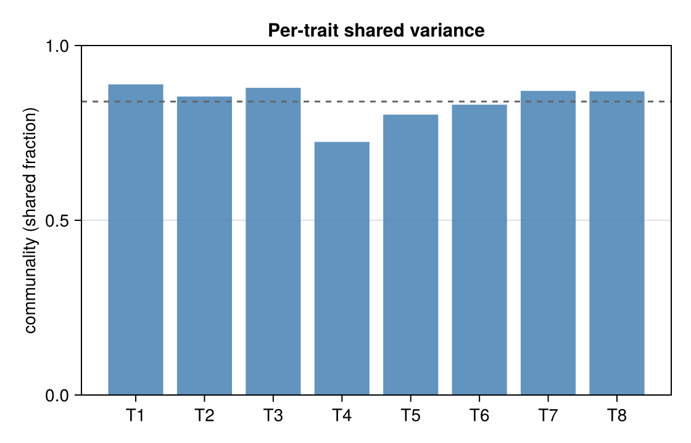

# Morphometrics: the simplest GLLVM

The simplest place to meet a GLLVM is **morphometrics** — several size or shape
measurements taken on each individual. Body parts grow together, so the
measurements are correlated; a GLLVM asks *how many underlying axes of variation
drive that correlation, and how much of each trait is shared versus
trait-specific.*

This worked example simulates a small morphometric dataset, fits a two-factor
Gaussian GLLVM, and reads the answer off the fit.

## Simulate measurements

We build `p = 8` traits on `n = 150` individuals from two latent axes — a
general "size" axis that loads on every trait, and a "shape" axis that contrasts
two groups of traits:

```julia
using GLLVM, Random
Random.seed!(7)

n, p, K = 150, 8, 2
size_axis  = [0.9, 0.8, 1.0, 0.7, 0.85, 0.75, 0.95, 0.8]   # loads on all traits
shape_axis = [0.7, 0.6, 0.5, 0.0, 0.0, -0.5, -0.6, -0.7]   # contrasts trait groups
Λ_true = hcat(size_axis, shape_axis)                        # p × K

Z = randn(K, n)
Y = Λ_true * Z .+ 0.4 .* randn(p, n)                        # p × n: traits × individuals
```

## Fit

```julia
fit = fit_gaussian_gllvm(Y; K = K)
```

The PPCA warm start lands on the optimum for a model with no diagonal random
effects or phylogeny, so L-BFGS typically reports convergence in 0–1 iterations.

## How much of each trait is shared?

`communality(fit)` returns the fraction of each trait's variance explained by the
shared latent axes — the remainder is trait-specific:

```julia
communality(fit)   # 8-element vector, each in [0,1]
```



Traits driven mostly by the common size/shape axes have high communality; a trait
that varies more on its own sits lower (the dashed line marks the mean). *Figure:
simulated data, two-factor fit.*

## Which traits move together?

`correlation(fit)` is the model-implied cross-trait correlation matrix; together
with `sigma_y_site(fit)` (the full `Σ_y`) it summarises the covariance the latent
axes induce:

```julia
correlation(fit)     # p×p, entries in [-1,1]
sigma_y_site(fit)    # p×p model-implied covariance Σ_y
```

Because latent factors are identified only up to rotation, interpret these
rotation-invariant summaries rather than the raw loadings `Λ` — see
[Common pitfalls](/pitfalls).

See also: [Get started](/quickstart) · [Covariance and correlation](/covariance-correlation) · [Reference](/api).
