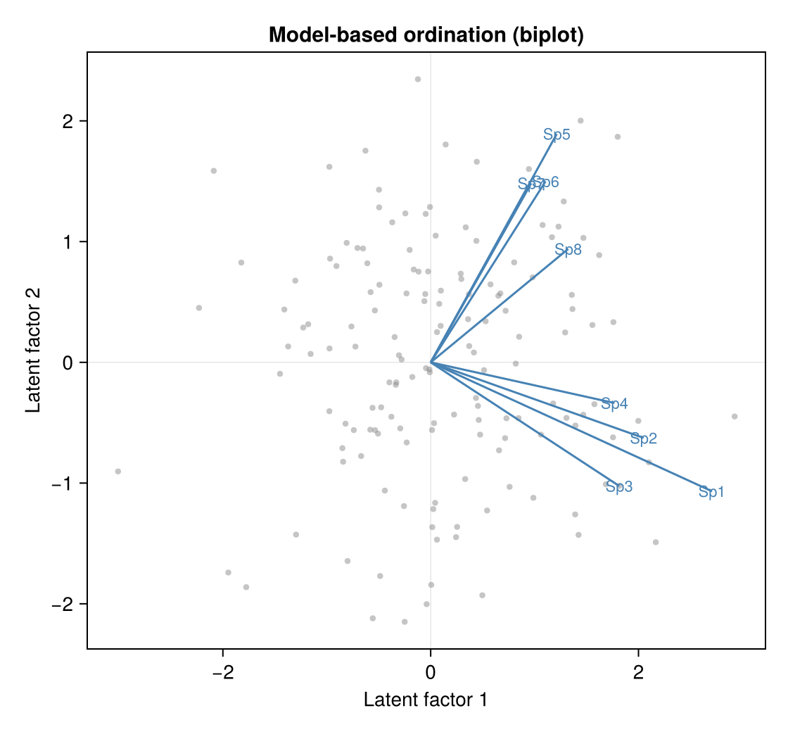

# Working with a fitted model

Once you have a fit from `fit_gaussian_gllvm`, `fit_gllvm(Y; family=…)`, or a
two-part fitter, GLLVM.jl gives you the standard post-fit toolkit: ordination,
predictions, residual diagnostics, and model-selection criteria. The current
coverage is broadest for Gaussian and the one-part Laplace families; two-part
fitters expose the same core summaries where the response-scale target is
defined.

```julia
using GLLVM, Random
Random.seed!(1)
n, p, K = 120, 6, 2
Λ = 0.8 .* randn(p, K)
Y = Λ * randn(K, n) .+ 0.5 .* randn(p, n)
fit = fit_gaussian_gllvm(Y; K = K)
```

## Ordination: latent scores and loadings

`getLV` returns the conditional latent-variable scores (the site ordination);
`getLoadings` the species loadings. Both come back in a canonical, reproducible
rotation by default:

```julia
Z = getLV(fit, Y)         # n×K site scores
L = getLoadings(fit)      # p×K species loadings
R = rotation(fit)         # K×K canonical rotation (Z and L share it)
```

Latent factors are identified only up to rotation, so the canonical orientation
(principal-axis SVD, signs fixed) makes the ordination reproducible — and `Λ Λᵀ`,
hence every covariance summary, is unchanged by it. Pass `rotate = false` for the
raw fitted loadings.

Plotting the site scores against the (scaled) loadings gives the model-based
ordination biplot — sites as points, species as labeled vectors:



*Simulated two-block data, two-factor Gaussian GLLVM. Species loading on the same
latent factor point the same way; the grey cloud is the site scores `getLV(fit, y)`.*

## Predictions and fitted values

```julia
η = predict(fit, Y; type = :link)        # linear predictor
μ = predict(fit, Y; type = :response)    # response scale
ŷ = fitted(fit, Y)                       # ≡ predict(…; type = :response)
```

For the Gaussian family the link is the identity, so `:link` and `:response`
coincide. For a binary fit `:response` returns fitted probabilities in `[0, 1]`.
There is no `newdata` yet — predictions are in-sample (that arrives with the
covariate/formula front-end).

## Residual diagnostics

`residuals` gives **Dunn–Smyth** randomized quantile residuals by default — the
GLLVM standard, approximately `N(0, 1)` under a correct model and comparable
across families. For discrete families the randomization uses an `rng`; pass a
seeded one to reproduce:

```julia
r  = residuals(fit, Y)                   # Dunn–Smyth
rp = residuals(fit, Y; type = :pearson)
```

A normal quantile–quantile plot of `r` is the usual goodness-of-fit check.

## Model comparison

```julia
aic(fit)            # 2k − 2·logLik
bic(fit, n)         # k·log(n_sites) − 2·logLik   (n_sites passed explicitly)
```

`k` is the free-parameter count (loadings counted modulo the `K(K−1)/2` rotational
identifiability). Lower is better — compare fits with different `K` (or different
families) to choose a model. Displaying the fit shows family, dimensions, the
log-likelihood, AIC, and convergence:

```julia
fit        # rich summary in the REPL
```

## Non-Gaussian fits

The same pattern works for the one-part non-Gaussian families. For example, a
binary fit takes an integer response matrix and returns Laplace-mode scores,
fitted probabilities, residuals, and information criteria:

```julia
fitb = fit_gllvm(Yb; family = Binomial(), K = 2)
getLV(fitb, Yb)                 # Laplace-mode scores
predict(fitb, Yb)               # fitted probabilities
residuals(fitb, Yb)             # Dunn–Smyth (set rng to reproduce)
```

The same entry point dispatches to Poisson, NegativeBinomial, Beta, Ordinal,
and Gamma fitters; see [Response families](response-families.md) for the current
family boundary.

See also: [Get started](quickstart.md) · [Response families](response-families.md) · [Reference](api.md).
