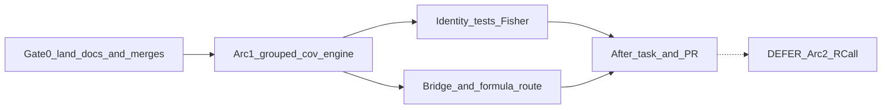

# NB2/Beta+X Engine Arc 1 (after Gate 0)

```
GOAL (paste-ready)
PLATFORM = Cursor (this session) · after G0 approval hand long verify to /goal or Claude if context pressure.
DELIVERABLE = (0) Push/PR design Arc 0; merge #172+#173 when CI green (fix Documenter on #172).
(1) Engine Arc 1: per-trait NB2/Beta φ + shared site-X, bridge+formula routed, identity tests green.
HEADLINE = Twin API B under X: stop routing NB2/Beta+X through shared-φ fit_gllvm_cov.
IN PARALLEL (Gate 0) = push Arc 0 PR · watch/fix CI on #172+#173 · rebase Arc 1 worktree onto post-merge main.
DEFER = Arc 2 light RCall NB2+X/Beta+X cells; Gamma+X; Ordinal+X; X_lv; ADEMP; Phylo Model A.
DISCIPLINE = no silent tol widen · identity with hessian=:fisher vs fit_gllvm_cov · production/bridge default hessian=:observed · R→Julia-only bridge · laptop/Totoro for Arc 1.
```

## WHAT THE BRAIN ALREADY KNOWS

- Twin stack = R public language + Julia engine; bridge execution R→Julia only (JuliaCall); RCall = opt-in oracle (MC `claim_guard.julia_surface`, drmTMB mirror).
- No-X API B (#169): public `fit_gllvm(NB/Beta)` → per-trait φ.
- Shared-X light logLik (#170): G/Bin/Pois only; NB2/Beta+X explicitly fenced.
- Design Arc 0 drafted locally: [decision](docs/dev-log/decisions/2026-08-02-nb2-beta-x-dispersion-identity.md) + [ultra-plan sketch](docs/dev-log/plans/2026-08-02-nb2-beta-x-identity-ultra-plan.md) @ `4e07fa3e` on `docs/nb2-beta-x-identity-20260802` (**not pushed**).

## Phase 0.25 sweep receipt

| Surface | Evidence | Finding | Call |
|---|---|---|---|
| repo git | `git status` ID worktree ahead 1; `branch_drift_check` 1 ahead / 0 behind; branches `docs/nb2-beta-x-identity-20260802`, `fix/grouped-dispersion…`, `docs/gllvm-capability-status…` | Design commit local only; #172/#173 open | **push/PR Arc 0**; **merge 172/173** before engine |
| twin / sister | decision + gllvmTMB disp.group intent; #170 X helpers | R twin expects per-trait under X | **build gap** = Julia grouped+X path |
| brain | `search_notes` “NB2 Beta X dispersion…” `search_all_projects:true` | Prior per-trait dispersion work exists; no conflicting “keep shared under X” lock | **reuse** API B decision; **build** X path |
| Verdict | | Genuinely new = **engine γ+per-trait pack + routing**; design exists but unlanded | **Gate 0 then Arc 1** |

## Locked design (no open options)

- Public/bridge default under X for NB2/Beta = **per-trait φ + shared site-X γ**.
- Implementation = new drivers `fit_nb_gllvm_grouped_cov` / `fit_beta_gllvm_grouped_cov` in [`grouped_dispersion.jl`](src/families/grouped_dispersion.jl) reusing `_build_offset` from [`covariates.jl`](src/families/covariates.jl) and existing grouped site Laplace (**offset already supported**).
- θ: `[β; γ; pack(Λ); log r_1…log r_G]` (Beta: φ). Default `hessian=:observed`; identity tests force `:fisher`.
- Keep [`fit_gllvm_cov`](src/families/covariates.jl) as **shared-φ + X opt-in**.
- Same PR routes [`bridge.jl`](src/bridge.jl) `_bridge_fit_onepart_cov` and [`formula.jl`](src/formula.jl) NB/Beta+X off shared cov onto the new path.
- Arc 2 (RCall light cells) is **out of this plan**.



## Gate 0 — land prerequisites (execute first after approval)

1. Push `docs/nb2-beta-x-identity-20260802` and open docs-only PR (decision + ultra-plan + board).
2. Diagnose/fix **Documenter failure** on [#172](https://github.com/itchyshin/GLLVM.jl/pull/172) (deploy step failed; Julia CI still pending at plan time). Merge #172 when green (self-merge OK: test identity, no tol widen).
3. Merge [#173](https://github.com/itchyshin/GLLVM.jl/pull/173) when green (docs).
4. Fresh worktree from post-merge `origin/main` for Arc 1: `fix/nb2-beta-x-grouped-cov-20260802`.

## Arc 1 — engine slices

| Slice | Member | Model / Bar | Detail |
|---|---|---|---|
| G0 land | Ada | Cursor Models | Push/PR Arc 0; CI/Documenter; merge 172/173 |
| S1 pack+ll | Gauss | Cursor Models | New `*_grouped_cov` fitters; θ + `_build_offset` + grouped marginal |
| S2 identity | Curie | Cursor Models | New `test/test_nb_beta_x_identity.jl`: G=1+X+fisher ≈ `fit_gllvm_cov`; constant rvec/φvec machine ll |
| S3 route | Hopper/Emmy | Cursor Models | `bridge.jl` + `formula.jl` + capability notes; exports in `GLLVM.jl` |
| S4 docs cascade | Darwin | Cursor Models | Docstrings + `docs/src/response-families.md` / tutorial if user-facing default changes |
| S5 verify | Rose | Other Models / judgment | Focused tests; check-log; after-task; claim fence; no Arc 2 claim |
| RECONCILE | Melissa | Other Models | plan-actual vs Gate0+Arc1 |

**Identity contract (must pass before merge):**
- `fit_*_grouped_cov(...; group=ones, hessian=:fisher)` logLik ≈ `fit_gllvm_cov` within existing band spirit (`atol=1e-2`, `rtol=1e-4`) — **no widen**.
- Constant per-trait vector + X offset matches shared cov marginal to ~1e-10 on ll at fixed params.

**Risk already priced:** `getLV` on grouped path ignores offset today — if bridge scores needed in Arc 1, thread offset through `_grouped_getLV`; otherwise fence scores until a follow-up and keep Arc 1 to fit+loglik+identity.

## Explicitly out of scope

- Arc 2 RCall NB2+X / Beta+X cells
- Gamma+X default flip
- Changing no-X API B
- Phylo Model A, ADEMP, coverage, Totoro/DRAC grids

## TEAM RAISED (compact)

- **Gauss** — Offset already on grouped site Laplace; missing γ pack + routing. Recommend thin `*_grouped_cov` wrappers. Identity must force Fisher.
- **Hopper** — Bridge early-routes all X through `fit_gllvm_cov`; formula hard-wires the same. Routing must ship with engine or twin surfaces keep lying.
- **Rose** — Documenter red on #172 blocks clean Gate 0; Arc 1 must not claim light RCall parity.
- **Ada** — Gate 0 then Arc 1 in one approved plan; Arc 2 separate `/goal` after identity greens.

## Estimate

- Gate 0: ~30–90 min (Documenter unknown).
- Arc 1: ~half-day to 1 day wall-clock; laptop fine.
- Fits one Cursor session if Documenter is quick; else hand off to `/goal` after Gate 0.

## After G0 approval

Do **not** expand this planning chat into a long Agent run. Emit a paste-ready `/goal` prompt that: (1) runs Gate 0, (2) implements Arc 1 from this plan, (3) stops before Arc 2.
